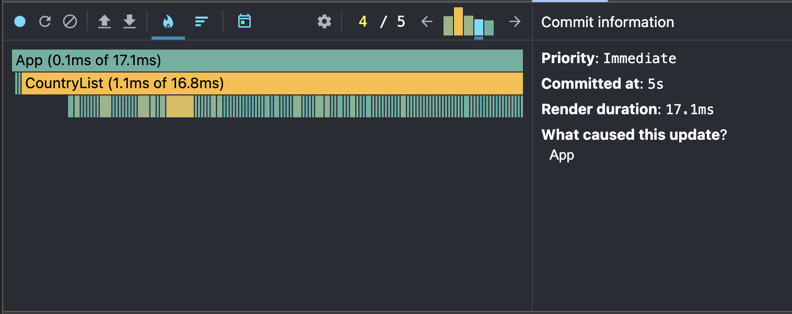
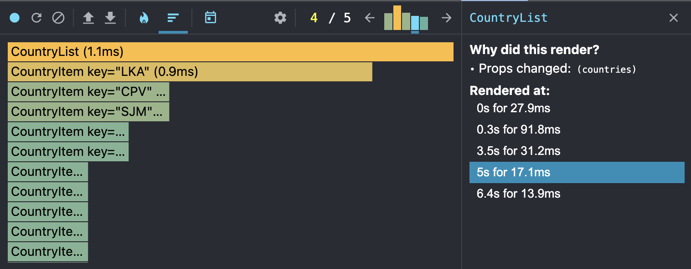
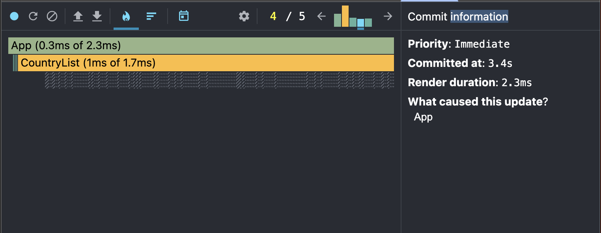
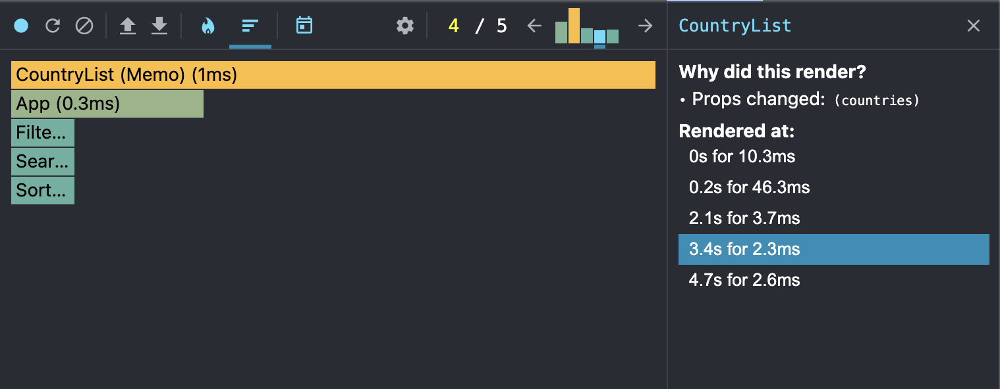

## Профилирование производительности

### 1. Исходное состояние (до оптимизации)

#### Параметры производительности:

- **Commit Duration:** Время, затраченное на рендеринг всех изменений после взаимодействия пользователя, составляло около **190 мс**.
- **Render Duration:** Время рендеринга компонента списка стран достигало **94 мс**.
- **Interactions:** Каждое взаимодействие (фильтрация, сортировка, поиск) вызывало ререндер всех компонентов, даже тех, которые не зависели от изменений.
- **Flame Graph:** На графике видно, что при каждом взаимодействии ререндерилось большое количество компонентов, включая карточки стран, которые не изменялись.
- **Ranked Chart:** Компоненты списка стран занимали наибольшее время рендеринга и рендерились каждый раз.

`{"type":"render","timestamp":"190ms","duration":"94ms","batchDuration":"134ms"}`

#### Скриншоты:

---

### 2. После оптимизации

#### Использованные оптимизации:

- **`useMemo`:** Для мемоизации отфильтрованных, отсортированных и найденных стран. Это предотвратило повторные вычисления при каждом рендере.
- **`useCallback`:** Для мемоизации обработчиков событий (фильтрация, сортировка, поиск). Это предотвратило создание новых функций при каждом рендере.
- **`React.memo`:** Для предотвращения ненужных ререндеров компонентов, таких как карточки стран. Компоненты теперь ререндерятся только при изменении их пропсов.
- **Правильное использование `key`:** Для списков, чтобы React мог эффективно обновлять только изменённые элементы.

#### Параметры производительности:

- **Commit Duration:** Время, затраченное на рендеринг всех изменений, сократилось до **166 мс**.
- **Render Duration:** Время рендеринга компонента списка стран уменьшилось до **48 мс**.
- **Interactions:** Теперь ререндерятся только те компоненты, данные которых запрашиваются первый раз.
- **Flame Graph:** На графике видно, что количество вычислений для ререндеров значительно уменьшилось.
- **Ranked Chart:** Если у нас уже есть данные о рендеринге, то компоненты списка стран больше не рендерятся каждый раз.

`{"type":"render","timestamp":"166ms","duration":"48ms","batchDuration":"107ms"}`

#### Скриншоты:

---
